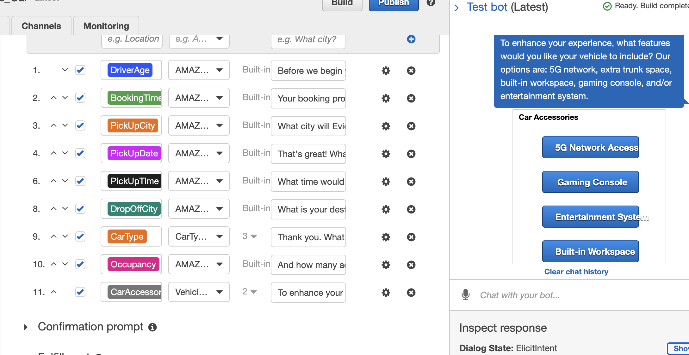

# Sali - AutoDrives Autonomous Car Booking Chatbot

*The following respository contains a chatbot created through Amazon Web Services Amazon Lex and Amazon Lambda functions for the CCT461 Speculative Design course at the University of Toronto Mississauga.*

By: Alexandra Dumitras-Geli, Jennifer Palfi, Melanie Zaky, & Nicole Stafferie

---

## Table of Contents

- [Project Objective](#Project-Objective) 
- [Installation Requirements](#Installation-Requirements)
- [Nagivating the Repository](#Navigtating-the-Repository) 
- [File Contents](#File-Contents)

---

## Project Objective 

The purpose of this project is to apply the perspective of a futuristic software or product developer through a speculative design approach. The objective is to establish a theorietical business operating approximately twenty to thirty years in the future offering an in-market demand service. 

### Objective Outcome

Alligning with the project objective, the autonomous car rental service, AutoDrives provides clients with a 24-hour rental service that can be booked through Sali, an Amazon Lex powered chatbot. 

To meet the demand of *plausible futures*, the AutoDrives service provides fully autonomous vehciles and additional vehcile accessories to improve the user experience when travelling for any period of time. 

**Future Direction**

Based on the scope of the project, there are future directions Sali, the car rental booking chatbot hopes to undertake. In addition to establishing a more robust user to bot conversation, Sali will proivde more information and resource access to users regaridng the organization. 

---

## Installation Requirements

Due to the nature of Amazon Web Services licensing and reproducibility, Sali is **not** a published chatbot. 

The chatbot **can** be manually deployed on the users local Amazon Web Services account console. 

To create an AWS account, please navigate through the following step-by-step resources *provided by the University of Toronto School of Continuing Studies FIntech program*: 

* [Creating an AWS Account](resources/1-Create-and-Activate-an-AWS-Account.md)

There are additional resources available through AWS to deploy chatbots. References can be found here: 

* [Intro to Amazon Lex](https://aws.amazon.com/lex/)
* [What is an Amazon Lex Bot?](https://docs.aws.amazon.com/lex/latest/dg/what-is.html)
* [Deploying an Amazon Lex Bot](https://docs.aws.amazon.com/lex/latest/dg/examples.html)

### Troubleshooting

If any issues arise when viewing the `AutoDrives Demo Video` or the `461 Bot Presentation` the user has the option to clone or donwload the repository to view all the files locally. 

Users must remember, github cannot display files that exceed a certain size. **Please download or clone the repository for grading purposes.**

**Additional Notes & Considerations to Grader**

To view some of the files within this repository **locally**; [readme](README.md), Design Reflection, and the [Lambda Function](lambda/lambda.py) **you will need** to use a thirdparty source code editor such as VS Code or access to Jupyter Lab. 

* Installing VS Code, documentation can be found [here](https://code.visualstudio.com/download)
* To set us VS Code, documentation can be found [here](https://code.visualstudio.com/docs/setup/setup-overview)

---

## Navigtating the Repository 

### Design Reflection 

The second critical component required for the assignment deliverables is the [Design Reflection](design_reflection.md) document. This document outlines the design process applied in the development of the Amazon Lex chatbot. 

For navigation ease and grading purposes, the Design Reflection can be found [here](design_reflection.md)

### Lambda Function

The lambda function operates as the business logic that allows Sali to respond to user requests. The lambda function is coded in json language and stored on a python file. The lambda function for the Amazon Lex chatbot can be found [here](lambda/lambda.py)

### Bots

This is an exported zip file of the Amazon Lex chatbot that is required to deploy locally on the users personal AWS console. 

### Intents

This is an exported zip file containging the Amazon Lex chatbot intent that is required to deploy locally on the users personal AWS console.

### Slots

This is an exported zip file containging the Amazon Lex chatbot slots that are required to deploy locally on the users personal AWS console.

### Images

This is a large directory containing sub-folders of the design process. The user can navigate through each folder to have a more in-depth overview of the design process seperate from the [Design Refelection Document](design_reflection.md)

### Videos

This directory contains demo videos that iterate the testing process of the chatbot. 

### Powerpoint Presentation 

The repository contains the in-class presentation of the AutoDrives autonomous car rental booking service. The presentation is titled `461_Bot_Presentation`

### Final Video

The repository contains the demo video for Sali an AWS Lex powered chatbot. The video is titled `AutoDrives Demo Video`

---

## File Contents 

* [Design Reflection](design_reflection.md)
* [Lambda Function](lambda/lambda.py)
* [Resources](resources)
* [Demo Videos](demo_videos)
* [Images](images)
* [Bots](bots)
* [Intents](intents)
* [Slots](slots)

---

